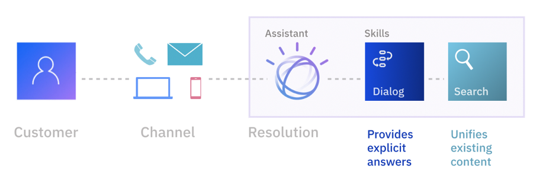
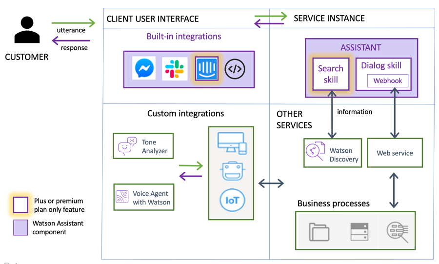

---

copyright:
  years: 2015, 2019
lastupdated: "2019-08-06"

subcollection: assistant

---

{:shortdesc: .shortdesc}
{:new_window: target="_blank"}
{:external: target="_blank" .external}
{:deprecated: .deprecated}
{:important: .important}
{:note: .note}
{:tip: .tip}
{:pre: .pre}
{:codeblock: .codeblock}
{:screen: .screen}
{:javascript: .ph data-hd-programlang='javascript'}
{:java: .ph data-hd-programlang='java'}
{:python: .ph data-hd-programlang='python'}
{:swift: .ph data-hd-programlang='swift'}

# 关于
{: #index}

使用 {{site.data.keyword.conversationfull}} 在任何设备、应用程序或通道中构建自己的品牌助手。助手会连接到您已使用的客户参与资源，以向客户提供统一互动的问题解决体验。
{: shortdesc}

## 工作方式
{: #index-how-it-works}

下图说明了产品的工作方式：

- 用户通过以下一个或多个**集成**点与助手进行交互：

  - 直接发布到现有社交媒体消息传递平台（例如，Slack 或 Facebook Messenger）的虚拟助手。
  - 您开发的定制应用程序，例如移动应用程序或具有语音界面的机器人。

- **助手**接收用户输入，并将其路由到对话技能。

- **对话技能**会进一步解释用户输入，然后定向会话流。对话会收集作出响应或代表用户执行事务所需的任何信息。

- 任何无法通过对话技能回答的问题都会发送到**搜索技能**，搜索技能将通过搜索您为此目的配置的公司知识库来查找相关回答。

## 实现
{: #index-implementation}

下图更详细地显示了实现方式：

下面是实现助手的方式：

- **创建助手**。

- **向助手添加技能**。

  可以添加以下类型的技能，具体取决于服务套餐：

  - **添加对话技能**。  
  
    使用直观的图形产品为助手与客户之间的会话定义训练数据和对话。训练数据包含以下工件：

    - **意向**：在用户与助手交互时您预期用户所持的目标。为可以在用户输入中识别到的每个目标定义一个意向。例如，可以定义名为 *store_hours* 的意向，用于回答有关门店营业时间的问题。对于每个意向，都可以添加样本话语，以反映客户可能用于询问其所需信息的输入，例如`你们几点开门？`

      或者，使用 IBM 提供的预构建**内容目录**，开始使用用于处理常见客户目标的数据。

    - **对话**：使用对话编辑器可构建包含意向的对话流。对话流以图形方式表示为树。可以添加分支来处理希望助手处理的每个意向。

    - **实体**：实体表示用于为意向提供上下文的词汇或对象。例如，实体可能是城市名称，用于帮助对话区分用户希望了解哪个门店的营业时间。添加实体后，请更新对话以使用这些实体。添加多个对话节点，用于根据用户输入中找到的实体来处理请求的许多可能的排列组合。

    在添加训练数据时，会自动向技能添加自然语言分类器。对该分类器模型进行训练，使其理解您指示助手侦听并响应的请求类型。

  - **添加搜索技能**。

    利用在 {{site.data.keyword.discoveryfull}} 中创建的数据集合，为客户的问题提供回答。在客户询问的问题不是对话设计为回答的问题时，助手可以从配置的数据源中搜索相关信息，抽取信息并将其作为助手的响应返回。

- **集成助手。**添加内置通道集成，以将配置的助手直接部署到社交媒体或消息传递通道。或者构建您自己的客户机应用程序作为助手的用户界面。

  部署的助手由 IBM 云计算平台 {{site.data.keyword.cloud}} 进行托管。（有关更多信息，请参阅[平台概述](/docs/overview/ibm-cloud#overview){: external}。）

通过访问以下链接，阅读有关这些实施步骤的更多信息：

- [助手概述](/docs/services/assistant?topic=assistant-assistants)
- [搜索技能概述](/docs/services/assistant?topic=assistant-skill-add-search)
- [意向创建概述](/docs/services/assistant?topic=assistant-intents#intents-described)
- [对话概述](/docs/services/assistant?topic=assistant-dialog-overview)
- [实体创建概述](/docs/services/assistant?topic=assistant-entities#entities-described)
- [添加集成](/docs/services/assistant?topic=assistant-deploy-integration-add)

## 浏览器支持
{: #index-browser-support}

{{site.data.keyword.conversationshort}} 需要的浏览器软件级别与 {{site.data.keyword.Bluemix_notm}} 所需的相同。有关更多信息，请参阅{{site.data.keyword.Bluemix_notm}} [先决条件](/docs/overview?topic=overview-prereqs-platform#browsers-platform){: external}。

## 语言支持
{: #index-lang-support}

[支持的语言](/docs/services/assistant?topic=assistant-language-support)主题中详细描述了功能部件支持的语言。

## 条款和声明
{: #index-notices}

有关服务条款的信息，请参阅 [IBM Cloud 条款和声明](/docs/overview/terms-of-use?topic=overview-terms){: external}。

美国健康保险可移植性和责任法案 (HIPAA) 支持可用于在 2019 年 4 月 1 日或之后创建且在华盛顿位置托管的高端套餐。有关更多信息，请参阅[启用欧盟支持和支持 HIPAA 设置](/docs/account?topic=account-eu-hipaa-supported#eu-hipaa-supported){: external}。

## 后续步骤
{: #index-next-steps}

- 产品[入门](/docs/services/assistant?topic=assistant-getting-started)。
- 查看[开发者资源](https://www.ibm.com/watson/developer-resources/){: external}列表。

有什么问题吗？请联系 [IBM 销售人员](https://www-01.ibm.com/marketing/iwm/dre/signup?source=urx-20970){: external}。
