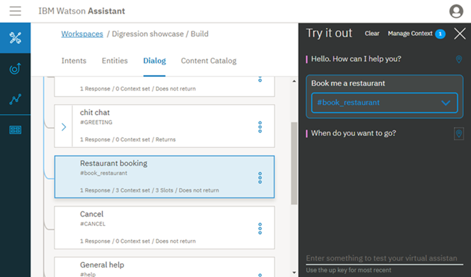
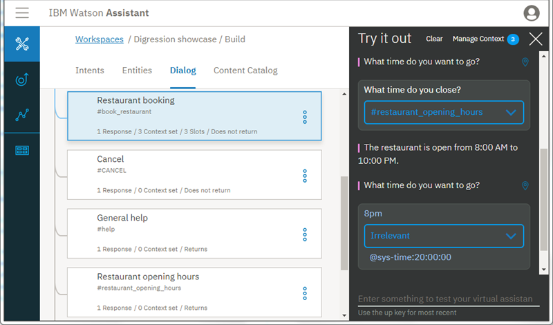

---

copyright:
  years: 2015, 2019
lastupdated: "2019-04-12"

subcollection: assistant

---

{:shortdesc: .shortdesc}
{:new_window: target="_blank"}
{:deprecated: .deprecated}
{:important: .important}
{:note: .note}
{:tip: .tip}
{:pre: .pre}
{:codeblock: .codeblock}
{:screen: .screen}
{:javascript: .ph data-hd-programlang='javascript'}
{:java: .ph data-hd-programlang='java'}
{:python: .ph data-hd-programlang='python'}
{:swift: .ph data-hd-programlang='swift'}

# 指導教學：瞭解離題
{: #tutorial-digressions}

在本指導教學中，您將直接看到離題是如何運作。
{: shortdesc}

## 學習目標
{: #tutorial-digressions-objectives}

在完成本指導教學之後，您將瞭解下列內容：

- 離題的運作設計
- 離題設定對於對話流程的影響
- 如何測試對話的離題設定

### 持續期間
{: #tutorial-digressions-duration}

本指導教學大約需要 20 分鐘才能完成。

### 必要條件
{: #tutorial-digressions-prereqs}

如果您沒有 {{site.data.keyword.conversationshort}} 實例，請完成[入門指導教學](/docs/services/assistant?topic=assistant-getting-started#getting-started-prerequisites)中的**開始之前**步驟來建立一個實例。

## 步驟 1：匯入離題展示對話技能
{: #tutorial-digressions-import-json}

首先，您需要將*離題展示* 對話技能匯入到 {{site.data.keyword.conversationshort}} 實例。

1.  下載 [digression-showcase.json](https://github.com/watson-developer-cloud/community/raw/master/watson-assistant/digression-showcase.json) 檔案。
1.  在 {{site.data.keyword.conversationshort}} 實例中，按一下  圖示。
1.  按一下**選擇檔案**，然後選取您先前下載的 **digression-showcase.json** 檔案。
1.  按一下**匯入**來完成匯入對話技能。

## 步驟 2：暫時從對話中脫離
{: #tutorial-digressions-temporarily-digress-away}

離題容許使用者從對話分支中離開以暫時變更主題，然後再回到原始的對話流程中。在此步驟中，您會開始進行餐廳預約，然後會脫離去詢問餐廳營業時間。在提供營業時間資訊之後，助理會返回到餐廳預約對話流程。

1.  按一下**對話**，從含有目的之頁面切換至對話樹狀結構的視圖。

1.  按一下  圖示，來開啟「試用」窗格。
1.  在文字欄位中鍵入 `Book me a restaurant`。

    助理會提示您輸入預約日期來作為回應：`When do you want to go?`。

1.  按一下該回應旁邊的**位置**  圖示，以強調顯示對話樹狀結構中觸發該回應的節點，亦即**餐廳預約**節點。

    
1.  鍵入 `Tomorrow`。

    助理會提示您輸入預約時間來作為回應：`What time do you want to go?`。

1.  您不知道餐廳何時關門，因此您詢問：`What time do you close?`。

    機器人會從餐廳預約節點脫離，去處理**餐廳營業時間**節點。它回應：`The restaurant is open from 8:00 AM to 10:00 PM`。然後，助理會回到餐廳預約節點，並再次提示您預約時間。

    
1.  **選用**：若要完成對話流程，請針對預約時間鍵入 `8pm`，針對來賓數目鍵入 `2`。

恭喜！您已成功脫離並回到對話流程。

## 步驟 3：停用空位離題
{: #tutorial-digressions-disable-slot}

在這個步驟中，您將編輯餐廳預約節點的離題設定，以防止使用者離題，並查看此設定變更如何影響對話流程。

1.  我們來看看**餐廳預約**節點的現行離題設定。按一下此節點以開啟其編輯視圖。

1.  按一下**自訂**，然後按一下**離題**標籤。

    

1.  將**容許離題**切換開關從「開啟」變更為**關閉**，然後按一下**套用**。

1.  按一下 ，以關閉節點編輯視圖。

1.  按一下「試用」窗格中的**清除**，以重設對話。

1.  鍵入 `Book me a restaurant`。

    助理會提示您輸入預約日期來作為回應：`When do you want to go?`。

1.  鍵入 `Tomorrow`。

    助理會提示您輸入預約時間來作為回應：`What time do you want to go?`。

1.  詢問：`What time do you close?`。

    助理可辨識該問題觸發 #restaurant_opening_hours 目的，但會忽略它，並再次改為顯示與 @sys-time 空位相關聯的提示。

您順利阻止使用者從餐廳預約處理程序中脫離。

## 步驟 4：離題到節點且不返回
{: #tutorial-digressions-digress-without-return}

您可以將對話節點配置成不回到助理當初脫離的節點，以處理現行節點。為了證明這一點，您將變更餐廳營業時間節點的離題設定。在步驟 2 中，您看到助理從餐廳預約節點脫離並跳到餐廳營業時間節點之後，又回到餐廳預約節點繼續執行預約處理程序。在此練習中，您變更設定之後，會從**工作機會**對話中脫離而去詢問餐廳營業時間，而且您會看到助理並未返回它當初離開的地方。

1.  按一下以開啟**餐廳營業時間**節點。

1.  按一下**自訂**，然後按一下**離題**標籤。

1.  展開**離題可進入這個節點**區段，並取消選取**在離題之後返回**勾選框。按一下**套用**，然後按一下 ，以關閉節點編輯視圖。

1.  按一下「試用」窗格中的**清除**，以重設對話。

1.  若要使用**工作機會**對話節點，請鍵入 `I'm looking for a job`。

    助理的回應是：`We are always looking for talented people to add to our team. What type of job are you interested in?`。

1.  不要回答此問題，而是詢問機器人不相關的問題。鍵入 `What time do you open?`。

    助理會離開「就業機會」節點而轉到「餐廳營業時間」節點來回答您的問題。助理會回應：`The restaurant is open from 8:00 AM to 10:00 PM.`。

    與前一個測試不同，這次對話不會回到它當初在**工作機會**節點離開的地方。助理不會回到進行中的對話，因為您將**餐廳營業時間**節點上的設定變更為不返回。

    

恭喜！您已成功脫離對話且不返回。

## 摘要
{: #tutorial-digressions-summary}

在本指導教學中，您體驗到離題如何運作，並看到個別的對話節點設定如何影響離題行為。

## 後續步驟
{: #tutorial-digressions-next-steps}

如果您在為自己的對話配置離題時需要協助，請參閱[離題](/docs/services/assistant?topic=assistant-dialog-runtime#dialog-runtime-digressions)。
